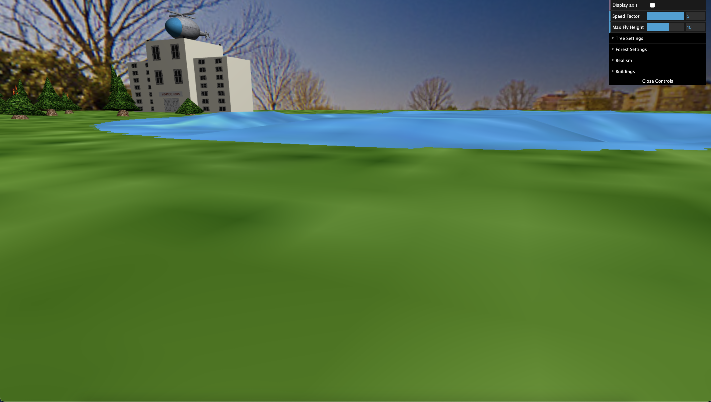
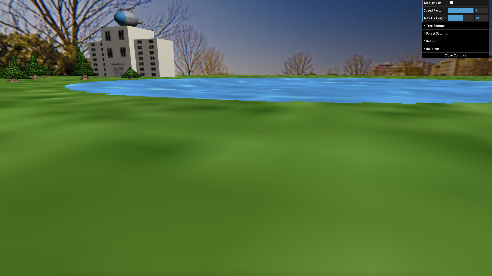

# Class 4 - Group 8

# Members

- up202205469 - António Abílio Parada Santos 
- up202205140 - Guilherme de Sá Guerra

# Screenshots

## project-t4g8-1

This photo shows two different perspectives where the panorama can be seen.

## project-t4g8-2

The screenshot shows a clear image of what our bulding looks and also in the top right corner the parameters that we are able to control are also shown.
These parameters get updated in real time.

## project-t4g8-3

The image below shows our trees and also the tree that can be parameterized (the blue tree in the back). In the shot it can also be seen the controls that allow
for the change of the tree's values.

## project-t4g8-4

Our helicopter is shown below and in it we can see the textures that were used as well as the objects that we used to create it. The main body and helices are made
of a metal looking texture and the window is made with a texture that resembles the glass used in a "real life" helicopter.

## project-t4g8-5

This photo shows the helicopter while its in the air. In the corner we can also see the parameters that can alter its behavior (The "Speed Factor" which changes how fast the helicopter moves and also the "Max Fly Height" which defines what is the cruizing altitude for the helicopter).

## project-t4g8-6

In the photo we can see the forest that and the fire that is in the trees. We can also see the lake from where the helicopter took some water and is now dumping it on
top of the trees. In our project we decided that the water supply is infinite while the fire is ongoing and as soon as the fire is out the water runs out. In the picture we also show the two extra parameters that we added... Since we decided that to extinguish the fire in the forest the water would have to pass through every tree that is on fire we thought that it would be a necessity having two parameters that not only define the size of the water drop and also the frequency of a drop of water falling from the bucket. Both of these parameters facilitate demonstration.

## project-t4g8-7

In the picture the flames and the animation can be seen. Since it is not possible to show the animation in the image we provide two destinct images of the same flame to compare.

## project-t4g8-8

For the aditional part we decided to choose the third (option C). A lake that feels more "real" by using shaders to add waves.
Again, since pictures cannot show the movement of the lake and the waves we provide two photos that show variation of the lake from the same position.

