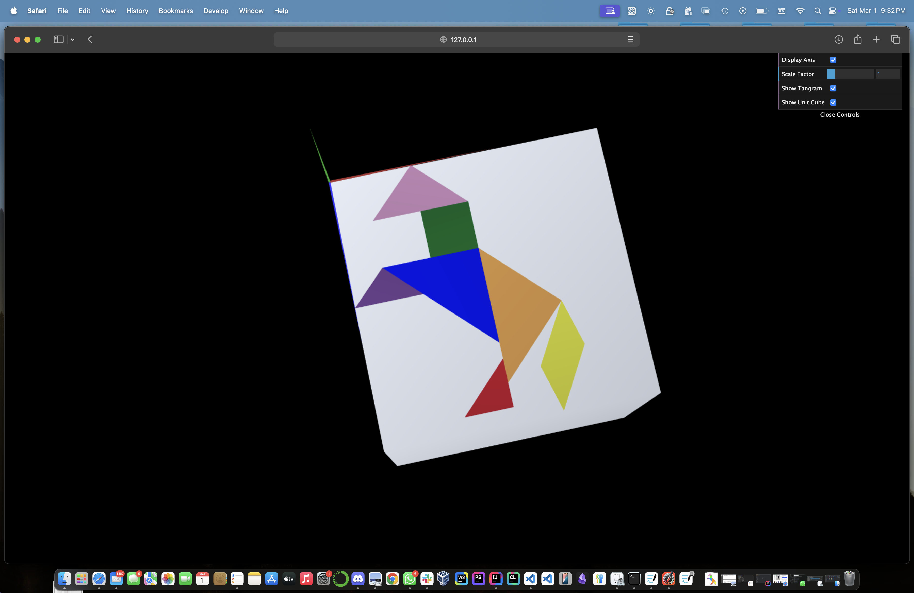
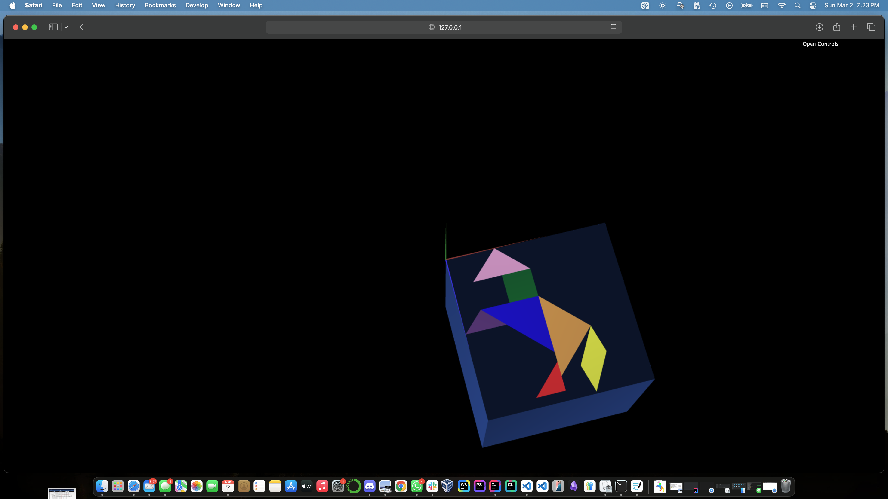

# CG 2024/2025

## Group T4G08

## TP 2 Notes

We found it easier to first translate the pivot point of the object to the final destination and only after this, apply the rotation.
This is because rotating first will also rotate the axis which will make it harder to determine what translation we should apply.

### Exercice 1


### Exercice 2

In this exercice we found that it was hard to differentiate the cube and the tangram. To fix this we went digging and found that we were somewhat able to
change the colors of the faces by using 

```js 
setDiffuse(redValue / 255, greenValue / 255, blueValue / 255, 0)
```

Also we found that if the cube was right behind the tnagram (to a point where both touch) even with different colors the tangram was not visible. To fix this instead of moving the cube by -0.5 on the y axis we moved it with a yOffset of -0.6.



### Exercice 3

This exercice was very similar to the last one to the point that the trnasformation that were performed on the cube worked without problems in the new cube made up of squares.
However we did notice that the light has changed and we suspect that it is due to the rotation that the were applied to the squares.

Just like in the other exercice we also colored the tangram and moved the cube by -0.6 on the y axis instead of moving it with a yOffset of -0.5.


