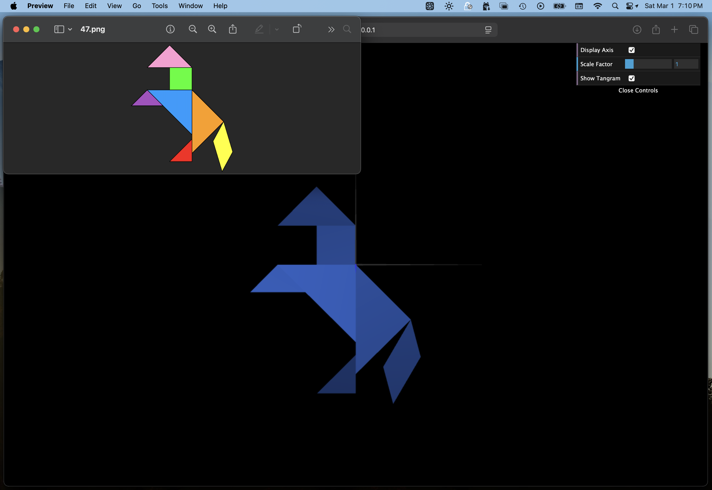

# CG 2024/2025

## Group T4G08

## TP 2 Notes

We found it easier to first translate the pivot point of the object to the final destination and only after this, apply the rotation.
This is because rotating first will also rotate the axis which will make it harder to determine what translation we should apply.

### Exercice 1

