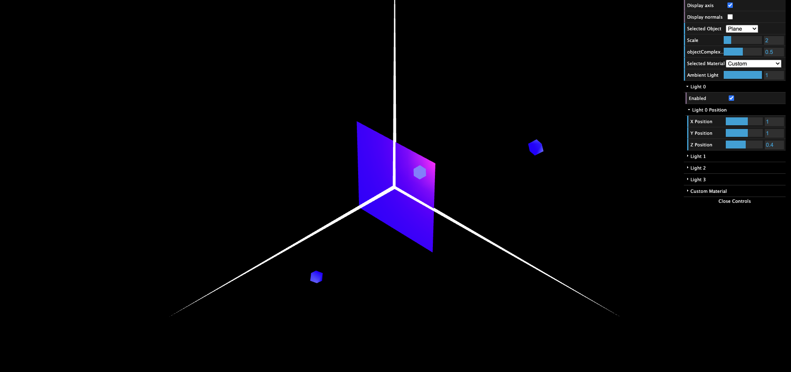

# CG 2024/2025

## Group T4G08

## TP 3 Notes

## Screenshots for the class

### Exercice 1

#### Unit Cube with Wooden Material

First we defined a normal for every vertex of the cube. After this we could create a new material with its color being similar to wood (hex #A1662F).
Defining these allows us to turn on the light and see the new color of the cube as seen in the screenshot:


#### Tangram

To make the tangram work we first had to define the normals for every atom piece of the tangram. This means we had to define normals of the Triangles, Parallelogram and Diamond.
After this was done we could start to define the colors of each piece. This was done using materials and applying each material to the corresponding piece.
For example:

The head of the horse (as in the original image) has a pinkish color. So, to create this color we first created a material where we defined the rgb components as follows:

```js
this.headMaterial = new CGFappearance(scene);
this.headMaterial.setAmbient(0.0, 0.0, 0.0, 1.0);
this.headMaterial.setSpecular(241 / 255, 161 / 255, 208 / 255, 0);
this.headMaterial.setDiffuse(0, 0, 0, 1.0);
this.headMaterial.setShininess(10.0);
```

and after we applied it to the corresponding triangle:

```js
this.head.display();
```

Because most of the materials only have the specular light enabled (ambient and diffuse are set to 0) we had to create more lights and change the attenuation of the lights to allow us to take a clear picture of the tangram with the right colors.


### Exercice 2

In this exercice we were tasked to build a prism that could have it complexity changed.
In the end of the exercice it we were tasked with making a prism with 8 sides and 20 stacks.
This is what is shown in the picture.


In this exercice we can see that due to the way normals are implemented the light creates a very distinct seam in between faces of the prism. Just like the picture below shows.


### Exercice 3

In this exercice we created a cylinder with 8 faces and 20 stacks. For this we reused the code from the Prism but changed it so that duplicate vertives and normals were removed. This was done to simulate the Gouraud method of shading.


As we can see (in relation to exercice 2) the edges are not as pronouced. The seams are pratically invisible and the whole object looks more rounded.

## Notes:

### Difuse Light

We observed that when the light is behind the polygon we cound't see the polygon.
However, after moving the light we started to see the color of the polygon appearing.

Moving the light to (x:2, y:2, z:1) we see that the polygon gets illuminated from the top right corner.
We also see that moving the camera does not affect the way light appears on screen. This is shown in the images down below:


This means that this type of light is not affected by the position of the observer.

### Specular Light

Specular light acts different when comparing against the difuse light. This is because specular light is affected by the
position of the observer.

This can be clearly seen in the images down below:


Changing the shininess we see that the object gets progressively darker as the shininess is higher.
This is expected as a shinier object means less spread of light thus it getting progressivelly darker and the beam of light more focused.


### Combination of lighting components

The combination of lighting components results in changes in the percived light. This means that if we have two light, one being a red light and another a blue light. When these two light sources combine the result is a pinkish light. This is what is happening in the image below:


Furthermore if we take the light and move closer we see that the place that lights up is smaller and altough we can still see the blue square this is only possible because we have ambient lighting turned on. If this component did not exist then we would (from any angle) only see the small source of light produced by the red light (light 0).



If we move further away from the cube the light will be able to reach more areas.


Now we were tasked with changing the complexity of the object. If we change the complexity while mantaining the light at the same position:


We see that because the sqaure is now composed by a different amount of triangles light is dispersed more evenly in the last photo relative to the first one.

More triangles means a greater dispersion of light which results in less seams and a smoother gradient.

### Light attenuation

We started by taking some observinf the light behaviour with it having a constant attenuation of 1:


These two photos show that a constant attenuation of 1 really makes the light have the same intensity regardless of the distance. The only thing that actually changes is the dispersion which is expected as light cannot bend thus if it is close to the object, only a small portion of the object is going to light up.

After this we moved on to changing the values of linear and quadratic light attenuation:

Linear attenuation:


Quadratic attenuation:


From these two images we can conclude that both linear and quadratic attenuation work by reducing the intensity of the light as the distance to the object gets higher and higher. We could also conclude that the quadratic attenuation is more aggressive when compared to the linear attenuation. This is expected as the quadratic attenuation has a bigger denominator when compared to the linear attenuation (d**2 > d).

If we used both at the same time the result (as expected) is even more light attenuation:


