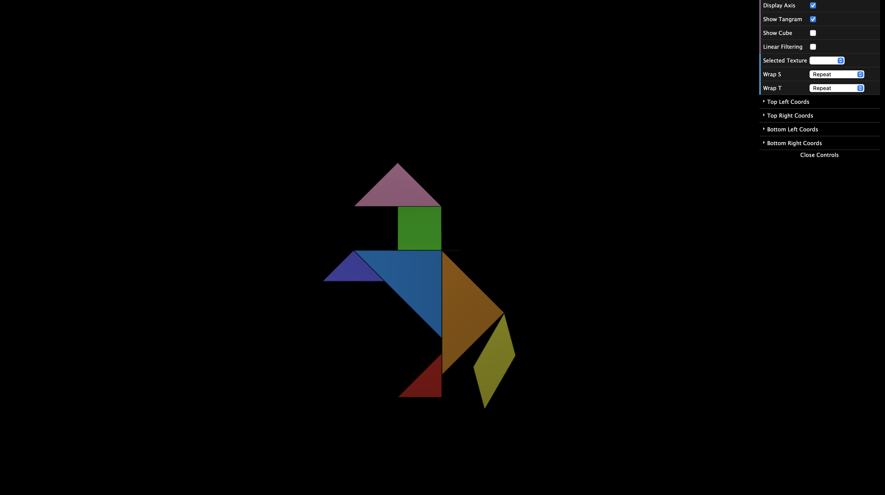
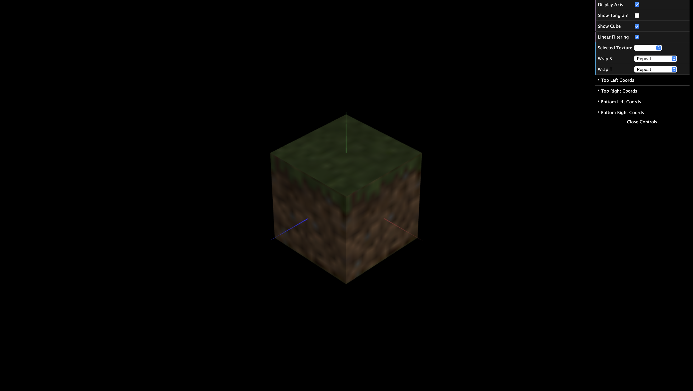
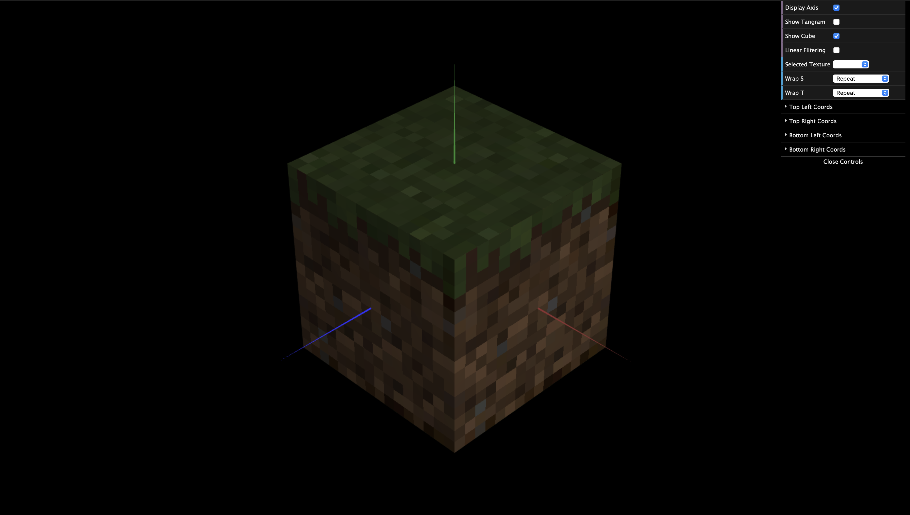

# CG 2024/2025

## Group T4G08

## TP 4 Notes

### Tangram

In this exercice we saw that to map a texture we first would need to define each point of the texture.
Each texture coordinate gets mapped to the corresponding vertex:

E.g.

```js
this.vertices = [
-0.5, -0.5, 0,	// Linked
    ...
];

this.texCoords = [
    0, 1,   // Linked
    ...
]
```



The next exercice told us to apply 3 textures to a cube. One for the top face, one for the sides and one for the bottom.
Initially the result was blurry due to WebGL defaulting to Linear Filtering which computes a weighted average of the surrounding texels before coloring a pixel (Bilinear interpolation).




To solve this we used Linear filtering which selects the closest texel without doing any average:




