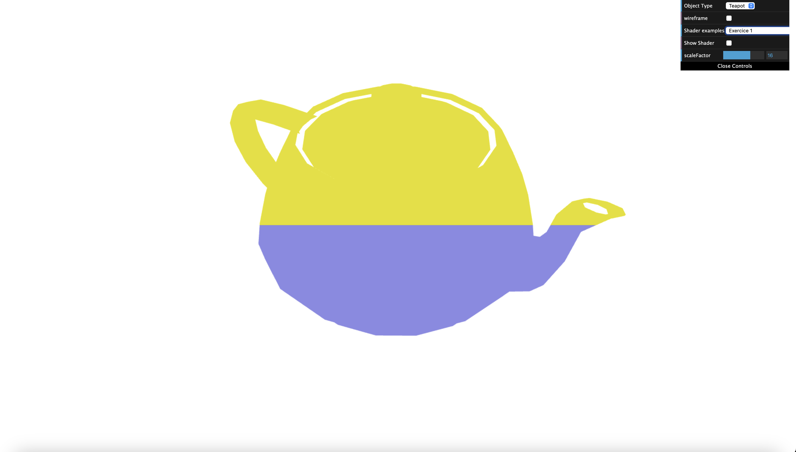
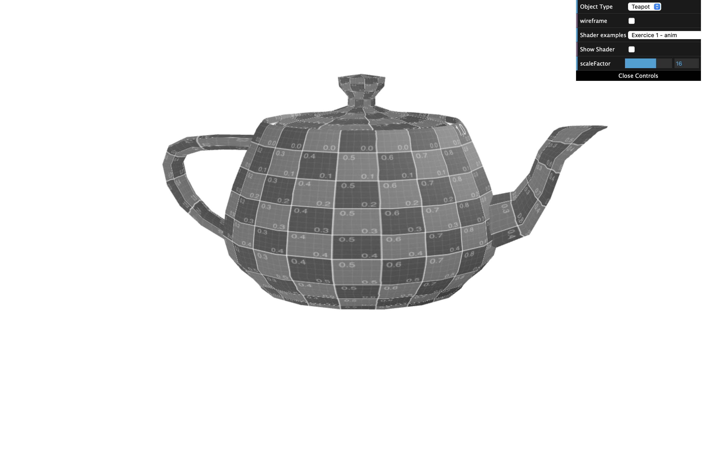
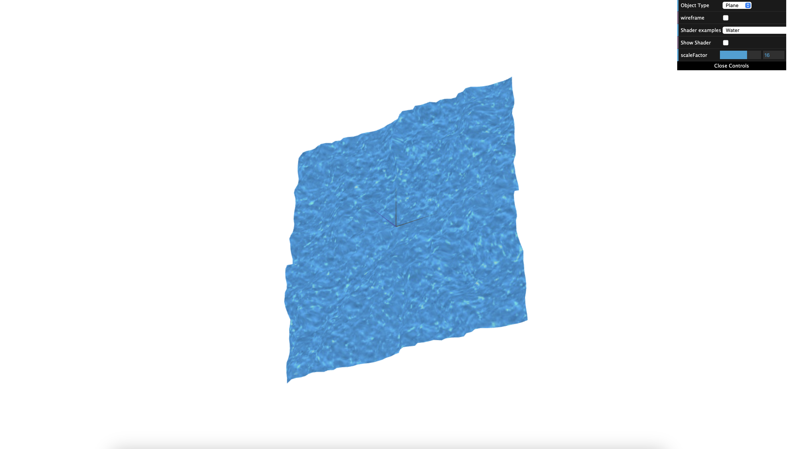

# CG 2024/2025

## Group T4G08

## TP 5 Notes

To make the color change we used this code fragment:

```gl
if (coords.y > 0.5) {
    gl_FragColor = vec4(1.0, 0.97, 0.0, 1.0) * uLight[0].diffuse;
    return;
}
```

which receives the coordinates of a vertex and checks if its y value is above the threshold (0.5) and in the case where that is true we
change the color to yellow and return immediatly otherwise we keep the original color (0.6, 0.6, 0.9).



To create a grayscale fragment shader we had to make the RGB values have the same values.
We converted the colors by making each rgb value the same using the given formula (L = 0.299R + 0.587G + 0.114B).



To move the water we used both shaders (fragment and vertex shaders) to create the illusion of the water moving and the formation of waves.
In the screenshot we were able to capture the water movement while it was occuring.



